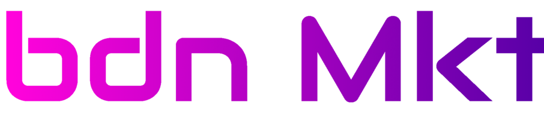

## Description

bdnHub is a suite of web3 development tool allowing users to restrict a website access for NFT owners. With its user-friendly interface, users can manage their NFTs and restrict website route access based on NFT ownership.

## BigDaddy Ecosystem

- [BigDaddyNFT Plugin](https://gitlab.bigdaddy-nft.com/bigdaddycore/bigdaddynftplugin)
  is a web3 development tool allowing users to restrict a website access for NFT owners.
  
- [bdn Creator](https://gitlab.bigdaddy-nft.com/bigdaddycore/bigdaddymintersite)
  is a website allowing users to create a NFT Collection. During creation, the BigDaddyContract will generate a siteId. This siteId is necessary to use the BigDaddyNFTPlugin
  
- [bdn Dev](https://gitlab.bigdaddy-nft.com/bigdaddycore/bigdaddydeveloppersite)
  is a website allowing developers to register a website Template that can be sold on BigDaddyMarketplace. 
  
- [bdn Mkt](https://gitlab.bigdaddy-nft.com/bigdaddycore/bigdaddymarketplace)
  is a website allowing users to but a Website Template and to deploy it with a personal SiteID on the Internet.


## Smart Contracts (actually on testnet)

[BigDaddyContract](https://flow-view-source.com/testnet/account/0xe3fc00107f99cc50/contract/BigDaddyContract)

[BigDaddyMarketplaceContract](https://flow-view-source.com/testnet/account/0xe3fc00107f99cc50/contract/BigDaddyMarketplaceContract)

[Flow Playground](https://play.flow.com/5c604886-8467-40f8-89f1-4cc8547ee63d)

## Installation

### Prerequisites

This application requires the following dependencies:

- "react": "^18.2.0"
- "react-dom": "^18.2.0"
- "react-router-dom": "^6.3.0"
- "@onflow/fcl": "^1.4.1"

### Installation Procedure

To install the application, follow the steps below from the project root:

```bash
curl -O https://raw.githubusercontent.com/BigDaddyNFT/BigDaddyMinterSite/main/bigdaddy.sh
sh bigdaddy.sh
```

## Usage

To use the application, modify the `App.js` file (or any file where React routes are defined) as follows:

```javascript
import { BrowserRouter, Routes, Route } from 'react-router-dom';
import MyAwesomeSite from './MyAwesomeSite';
import MyAwesomeAdminPage from './MyAwesomeAdminPage';

// Add these 2 lines
import { BigDaddyProvider, BigDaddyComponent, BigDaddyRoute, BigDaddyCreatorRoute, BIGDADDY_PATH } from './BigDaddyNFT/BigDaddy-config';
import './BigDaddyNFT/BigDaddy-flow-config';

function App() {
  return (
    <BrowserRouter>
// Add The BigDaddyProvider and provide your siteid (from BigDaddy Minter Page), the path you want the user to be redirect after NFT verification, you can also add a CreatorRoute which restrict acces only for the creator of the collection
// the path of the image that you want to represent your NFT, and your logo image path 
     <BigDaddyProvider siteId="mysiteid" pathAfterAuth="mypath" creatorPathAfterAuth="mycreatorpath" nftImagePath="nftImagePath" logoImagePath="yourlogoImagePath">
        <Routes>
        // Add the route for the BigDaddyComponent
          <Route path={BIGDADDY_PATH} element={<BigDaddyComponent />} />
        // Protect your website routes with BigDaddyRoute
          <Route path="/" element={<BigDaddyRoute><MyAwesomeSite /></BigDaddyRoute>} />
        // Protect your website admin route with BigDaddyCreatorRoute
          <Route path="/admin" element={<BigDaddyCreatorRoute><MyAwesomeAdminPage /></BigDaddyCreatorRoute>} />
        </Routes>
      </BigDaddyProvider>
  </BrowserRouter>   
  );
}

export default App;
```

## Websites

Go to 
<a href="https://creator.testnet.bdnhub.com/">
    
</a>


Go to
<a href="https://dev.testnet.bdnhub.com/">

</a>

Go to <a href="https://mkt.testnet.bdnhub.com/">

</a>


## Contributing

Contributions are what make the open-source community such an amazing place to learn, inspire, and create. Any contributions you make are greatly appreciated.


## Contributors

BigMahefa (github profile mahefa621@gmail.com)

BigHarick (github profile harick.one@gmail.com)


## Contact

You can contact us at bigdaddy@bigdaddy-nft.com or on our mattermost server https://mattermost.bigdaddy-nft.com/

